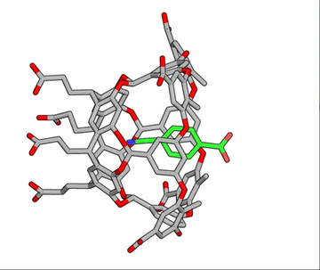
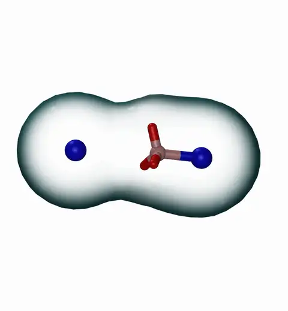
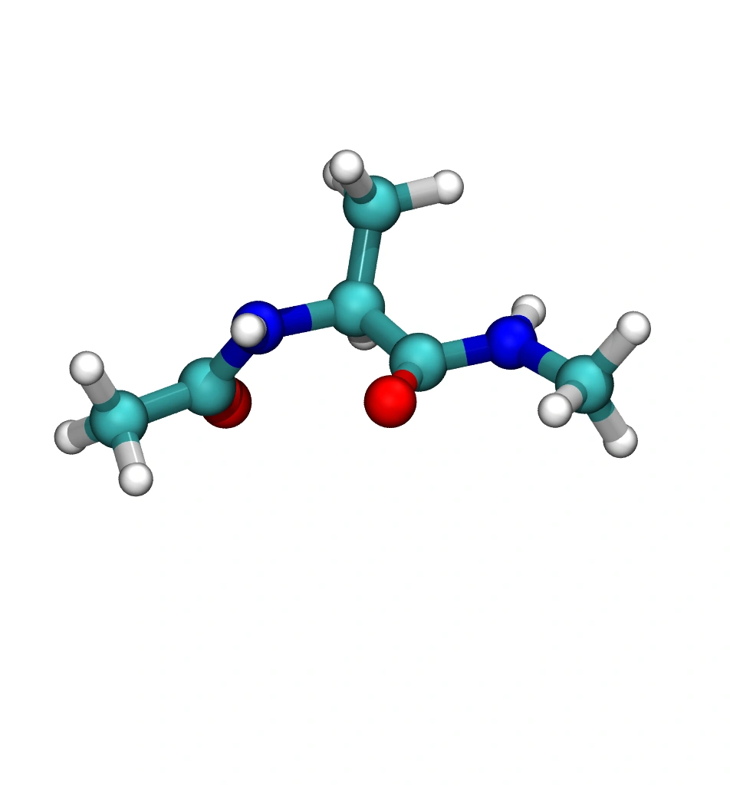

# PathGennie

PathGennie is a lightweight Python toolkit for generating reactive molecular
dynamics paths with short adaptive MD bursts. It supports AMBER, GROMACS, and
OpenMM backends through small, case-local `input.yaml` files plus user-defined
collective variables and convergence checks.

The workflow is designed for fast path discovery: launch multiple short
`tau1` trials from the current anchor state, bias the next anchor toward
progress in a projection space, continue with `tau2`, and repeat until the
case-specific convergence criterion is met.

## Examples at a Glance

The repository includes compact examples for conformational change, peptide
folding/unfolding, host-guest unbinding, and QM/MM steering.

| Example                              | Backend(s)             | What it demonstrates                                           |
| ------------------------------------ | ---------------------- | -------------------------------------------------------------- |
| `examples/alanine_dipeptide`         | AMBER, GROMACS, OpenMM | Targeted phi/psi transition between Ramachandran basins        |
| `examples/CLN025`                    | AMBER, GROMACS         | Chignolin path generation with end-to-end distance projections |
| `examples/OAMe-G2`                   | AMBER, GROMACS         | Host-guest unbinding with COM-COM distance projections         |
| `examples/qmmm_alanine_conformation` | AMBER                  | QM/MM alanine-dipeptide conformational steering                |

### Movie Examples

These animations are tracked in the repo and can be used as visual references
for the kinds of paths PathGennie produces.

<table>
  <tr>
    <td width="33%" align="center">
      <!-- <strong>Host-guest unbinding</strong><br> -->
      
    </td>
    <td width="33%" align="center">
      <!-- <strong>Reactive path example</strong><br> -->
      
    </td>
    <td width="33%" align="center">
      <!-- <strong>Molecular transition example</strong><br> -->
      
    </td>
  </tr>
</table>

## Repository Layout

```text
pathgennie/
  core/         Backend-independent driver, selection, progress, device pool,
                Engine + ExplorerPolicy protocols, strategy profiles, toy engine
  cv/           Data-driven CVs: NumPy featurization + on-the-fly SPIB
                (learned CV + emergent metastable states; needs PyTorch)
  search/       Non-linear search: RRT / RRT-Connect + conformational roadmap
                graph (Dijkstra + Yen k-shortest all-pairs pathways)
  agent/        Rule-based agentic controller (adaptive N / tau1 / tau2)
  sampling/     Enhanced-sampling stages on one contract (PathEnsemble +
                SamplingStage): path-informed Weighted Ensemble and OPES (PLUMED)
  backends/
    amber/      Device-aware AMBER engine + runner
    gromacs/    Device-aware GROMACS engine + runner
    openmm/     OpenMM in-process engine + runner
docs/           Manual + tutorials (start at docs/index.md)
tests/          pytest suite (69 tests; selection, CV, I/O, device dispatch,
                SPIB, RRT, roadmap, controller, WE, OPES)
benchmarks/
  scaling.py    Device-pool scaling benchmark
  we_fes.py     WE free-energy validation vs the analytic Wolfe-Quapp marginal
examples/
  alanine_dipeptide/
  CLN025/
  OAMe-G2/
  qmmm_alanine_conformation/
assets/
  unbind.gif
  unbind.webp
  reaction.webp
  movie.webp
CHANGELOG.md
environment.yml
```

## Documentation

Full manual and tutorials live in [`docs/`](docs/index.md); release notes in
[`CHANGELOG.md`](CHANGELOG.md); the forward-looking strategic plan in
[`ROADMAP.md`](ROADMAP.md). Highlights: [multi-GPU](docs/multi-gpu.md),
[strategy profiles](docs/strategy-profiles.md), [SPIB CV](docs/data-driven-cv.md),
[RRT search](docs/non-linear-search.md), [roadmap graph](docs/roadmap-graph.md),
[agentic controller](docs/agent.md), [Weighted Ensemble](docs/weighted-ensemble.md),
and [OPES](docs/opes.md).

## Installation

Create the supplied Conda environment:

```bash
conda env create -f environment.yml
conda activate pathgennie
```

Install the package from this checkout:

```bash
pip install .
```

For development, install it in editable mode:

```bash
pip install -e ".[examples]"
```

Backend executables are configured per example. Update paths such as
`amber.executable` or `gromacs.executable` in the relevant `input.yaml` before
running on your machine.

## Running Examples

### AMBER: Alanine Dipeptide

```bash
cd examples/alanine_dipeptide/amber
python run_pg_amber.py
```

Outputs are written to `pathgennie_amber_run/output/` by default:

- `reactive_path.pdb`
- `metrics.csv`

### GROMACS: Alanine Dipeptide

```bash
cd examples/alanine_dipeptide/gromacs
python run_pg_gromacs.py
```

Outputs are written to `pathgennie_gmx_run/output/` by default:

- `reactive_path.xtc`
- `metrics.csv`

### OpenMM: Alanine Dipeptide

```bash
cd examples/alanine_dipeptide/openmm
python run_pg_openmm.py
```

Outputs are written to `pathgennie_openmm_run/output/` by default:

- `reactive_path.dcd`
- `metrics.csv`

### AMBER QM/MM: Alanine-Dipeptide Conformation

```bash
cd examples/qmmm_alanine_conformation/amber
python run_pg_amber.py --config input_c7eq.yaml
python run_pg_amber.py --config input_c7ax.yaml
```

See
[`examples/qmmm_alanine_conformation/amber/README.md`](examples/qmmm_alanine_conformation/amber/README.md)
for the QM/MM region, targets, and regeneration notes.

## Configuration Model

Each case is driven by a case-local YAML configuration file (typically `input.yaml`) containing configuration options for the simulation backend, PathGennie adaptive sampling parameters, MD engine controls, and the projection/convergence functions.

<<<<<<< HEAD
- Backend block: `amber`, `gromacs`, or `openmm` input files and executable
  settings.
- `pathgennie`: adaptive sampling settings such as `mode`, `tau1_steps`,
  `tau2_steps`, `max_trial`, `max_cycle`, `sigma`, and `temperature`.
  Multi-GPU / reproducibility keys: `devices` (list of GPU indices to spread the
  swarm across), `workers_per_device` (concurrent segments per GPU; replaces the
  legacy `tau1_workers`), and `seed` (master RNG seed for the selection and
  velocity draws).
  Goal key: `profile` (`discovery` for fast candidate paths with ultrashort,
  greedy, geometric-CV trajectories — the original regime; `sampling` for longer
  trajectories, a learned CV, and a downstream enhanced-sampling stage). Profile
  values are defaults; any explicit `pathgennie` key overrides them.
- `projection`: Python module and function that map coordinates to a
  collective-variable vector.
- `convergence`: Python module and function that decide when the generated path
  has reached the desired state.
=======
### Configuration Reference
>>>>>>> origin/pathcv

#### 1. Root Level
* `workdir` (str): Output and scratch directory path. Defaults to `pathgennie_run` (AMBER), `pathgennie_gmx_run` (GROMACS), or `pathgennie_openmm_run` (OpenMM).
* `output` (dict, OpenMM only): Override output files:
  * `trajectory` (str): Filename for output reactive path. Defaults to `reactive_path.dcd`.
  * `metrics` (str): Filename for output metrics CSV. Defaults to `metrics.csv`.
  * `wrap_pbc` (bool): If `true`, wrap coordinates within periodic box boundaries. Defaults to `false`.
* `system` (dict, OpenMM only):
  * `system_file` (str): Python script file (e.g., `system.py`) containing a custom `make_system` builder.

#### 2. Backend Block (Specify one based on engine)
##### AMBER (`amber`)
* `topology` (str): Path to `.prmtop` topology file.
* `initial_restart` (str): Path to `.rst7` or `.inpcrd` coordinate file.
* `executable` (str): Path to simulator executable (e.g., `sander`, `pmemd`, `pmemd.cuda`).
* `system` (str): System type, either `"explicit"` or `"implicit"`. Defaults to `"explicit"`.
* `mpi_launcher` (str, optional): MPI launcher executable (e.g., `mpirun`, `mpiexec`).
* `mpi_ranks` (int, optional): Number of parallel MPI processes (default: 1).
* `mpi_launcher_args` (list, optional): Additional arguments for the MPI launcher.

##### GROMACS (`gromacs`)
* `topology` (str): Path to `.top` topology file.
* `initial_structure` (str): Path to `.gro` coordinate structure file.
* `executable` (str): Path to GROMACS executable (e.g., `gmx`, `gmx_mpi`).
* `mdp` (str): Path to a base GROMACS `.mdp` control template file. Defaults to `md.mdp`.
* `reference_template` (str, optional): Reference structure/topology file for mapping atom indices. (aliases: `reference_structure`, `metadata`). Defaults to `initial_structure`.
* `grompp_args` (list, optional): List of command line flags to pass to GROMACS `grompp`.
* `mdrun_args` (list, optional): List of command line flags to pass to GROMACS `mdrun`.

##### OpenMM (`openmm`)
* `topology` (str): Path to AMBER `.prmtop` or GROMACS `.top` topology file.
* `initial_restart` (str): Path to AMBER `.rst7` / `.inpcrd` or GROMACS `.gro` coordinate structure file.
* `platform` (str): OpenMM platform name (`Reference`, `CPU`, `CUDA`, or `OpenCL`). Defaults to `CPU`.

#### 3. PathGennie (`pathgennie`)
* `mode` (str): Sampling mode, either `"escape"` (drive progress away from start) or `"target"` (drive progress toward a target state).
* `tau1_steps` (int): Number of MD simulation steps per short-burst sampling trial.
* `tau2_steps` (int): Number of MD simulation steps per segment extension.
* `max_trial` (int): Number of parallel sampling trials run in each cycle.
* `max_cycle` (int): Maximum number of adaptive sampling cycles to run.
* `save_freq` (int): Number of cycles between saving coordinate frames (default: 10).
* `sigma` (float): Boltzmann weighting parameter controlling selection bias (lower = higher bias).
* `temperature` (float): Simulation temperature in Kelvin (default: 300.0).
* `verbosity` (int): Logging detail level: `0` (silent), `1` (minimal), `2` (verbose).
* `target_projection` (list of float, Target Mode only): Coordinate target coordinates.

#### 4. MD Parameters (`md`)
* `controls` (dict, AMBER/GROMACS): Key-value dictionary of `.mdin` or `.mdp` config parameters to override.
* `extra_text` (str, AMBER only): Arbitrary block of text to append to the end of the generated `.mdin` files.
* `timestep_ps` (float, OpenMM only): Integrator step size in picoseconds. Defaults to `0.002`.
* `friction_per_ps` (float, OpenMM only): Langevin integrator friction coefficient. Defaults to `1.0`.
* `equilibration_steps` (int, OpenMM only): Equilibration steps to run before path generation. Defaults to `0`.
* `pressure` (float, OpenMM only): System pressure in bar for Barostat when custom builders are loaded. Defaults to `1.0`.
* `plumed_file` (str, OpenMM only): Path to PLUMED file to attach PLUMED-based forces.

#### 5. Projection CV (`projection`)
* `module` (str): Case-local Python filename (without `.py`) containing the CV calculation function.
* `function` (str): Name of the Python function within that module.
* *Additional options*: Any extra keys defined in this block are passed dynamically as keyword arguments (`**kwargs`) to the projection function.

#### 6. Convergence (`convergence`)
* `module` (str): Case-local Python filename (without `.py`) containing the convergence check function.
* `function` (str): Name of the Python function.
* *Additional options*: Any extra keys defined in this block are passed dynamically as keyword arguments (`**kwargs`) to the convergence function.

---

### Example Configuration Files

#### Example target-mode configuration:

```yaml
pathgennie:
    mode: target
    target_projection: [60.0, 40.0]
    tau1_steps: 2
    tau2_steps: 4
    max_trial: 10
    max_cycle: 1000
    save_freq: 10
    sigma: 0.1
    temperature: 300

projection:
    module: phi_psi
    function: phi_psi_cv

convergence:
    module: phi_psi
    function: reached_phi_psi
    target: [60.0, 40.0]
    tolerance: 15.0
```

#### Example escape-mode configuration:

```yaml
pathgennie:
    mode: escape
    tau1_steps: 5
    tau2_steps: 10
    devices: [0, 1, 2, 3]   # spread the 10 samplers across 4 GPUs
    workers_per_device: 1
    seed: 12345             # reproducible selection / velocity draws
    max_cycle: 5000
    save_freq: 2
    sigma: 0.25
    temperature: 300

projection:
    module: projection
    function: com_com_distance_cv
    group_a_resname: OCB
    group_b_resname: MOL

convergence:
    module: projection
    function: dissociated
    group_a_resname: OCB
    group_b_resname: MOL
    threshold: 10.0
```
## TODO: Overwrite issue

## Data-Driven CVs (SPIB)

Instead of a hand-crafted progress variable, PathGennie can learn one on the fly
with **SPIB** (State Predictive Information Bottleneck, `pathgennie.cv.spib`),
which jointly learns a low-dimensional CV and an emergent set of metastable
states from the frames the run visits. `SPIBProgress` bootstraps from a coarse
geometric CV, buffers the path, retrains periodically (the iterative
path-learning cycle), and then steers using the learned latent. It is an adaptive
`ProgressVariable`, so it plugs into the same driver as the built-in metrics.
Requires the `ml` extra (`pip install -e .[ml]`, i.e. PyTorch).

## Enhanced Sampling: Weighted Ensemble

Once a path is discovered, the `sampling` package turns it into quantitative
results. `WeightedEnsembleStage` (`pathgennie.sampling.weighted_ensemble`) runs
**path-informed Weighted Ensemble**: it seeds weighted walkers from the discovered
`PathEnsemble`, propagates them with *unbiased* MD (reusing the same `Engine` and
multi-GPU executor — no bias forces), and resamples (split/merge, weight-conserving)
to keep walkers spread across CV bins along the path. It returns a free-energy
profile along the CV and, with recycling enabled, a steady-state rate constant.

WE and the OPES stage implement one `SamplingStage` contract and are selected by
name via `make_stage("weighted_ensemble" | "opes", ...)` or the
`pathgennie.downstream` config key, which the backends honour: set
`downstream: weighted_ensemble` (plus a `weighted_ensemble:` block) and the run
discovers a path then runs WE automatically, writing `free_energy.csv` (and
`rate_constants.json` if recycling). To do it from Python, run the driver with
`collect_seeds=True` and build the ensemble with `build_path_ensemble(...)`.
`benchmarks/we_fes.py` validates the recovered free energy against the analytic
Wolfe–Quapp marginal (Pearson r ≈ 0.99).

**OPES (free-energy surfaces) via PLUMED.** `OPESStage`
(`pathgennie.sampling.opes`) generates an `OPES_METAD` PLUMED input and drives a
PLUMED-capable engine; a dependency-free OPES core (verified on the toy
Wolfe–Quapp marginal) is also provided. See [docs/opes.md](docs/opes.md).

**Path sampling (TPS/TIS) via OpenPathSampling.** As an alternative to WE for
kinetics, `PathSamplingStage` (`pathgennie.sampling.path_sampling`) bridges a
discovered `PathEnsemble` to [OpenPathSampling](https://openpathsampling.org/):
PathGennie's reactive path seeds TPS/TIS. The seed preparation (state ranges,
reactive sub-path extraction, TIS interfaces) is dependency-free and tested;
running TPS/TIS needs the `pathsampling` extra and an OPS engine. See
[docs/path-sampling.md](docs/path-sampling.md).

## Non-Linear Search, Roadmap & Agent

Beyond the greedy path, `pathgennie.search.rrt` provides **RRT / RRT-Connect**
tree search for pathways the monotone metric cannot follow (backtracking,
direction changes, orthogonal CVs), `pathgennie.search.roadmap` builds a
conformational graph and extracts the minimum-free-energy and competing pathways
between metastable states (Dijkstra + Yen), and `pathgennie.agent` provides a
rule-based controller that adapts the swarm size and segment lengths on the fly.
See the [docs](docs/index.md) for details and tutorials.

## Writing a New Case

1. Copy the closest example directory for your backend.
2. Replace topology, coordinate, restart, and MD-control files.
3. Update the backend executable path in `input.yaml`.
4. Implement a projection function that accepts coordinates and returns a NumPy
   array-like CV.
5. Implement a convergence function that returns `True` when the path is done.
6. Tune `tau1_steps`, `tau2_steps`, `max_trial`, `sigma`, and `max_cycle` for the
   system size and available compute.

## Outputs

PathGennie writes two primary artifacts:

- Reactive path trajectory: backend-dependent format such as `.pdb`, `.dcd`,
  `.xtc`, or `.nc`.
- Metrics CSV: one metric sample per adaptive cycle.

For AMBER and GROMACS runs, scratch files are created under the configured
`workdir` and removed after a successful run. Generated `tau1` and `tau2` MD
control files are kept in the work directory for inspection.

## License

This project is distributed under the terms of the
[`LICENSE`](LICENSE) file.
